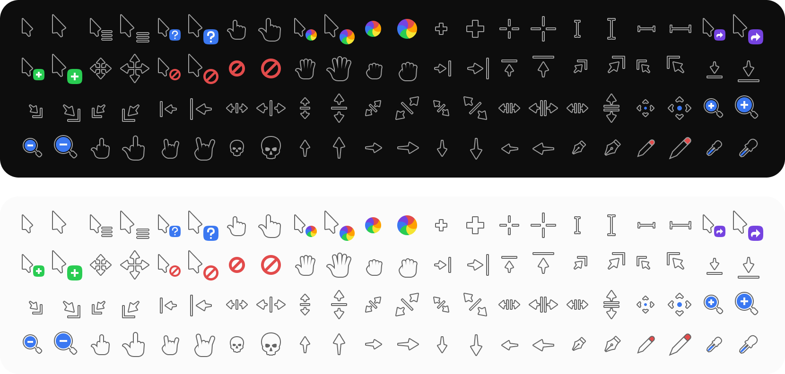
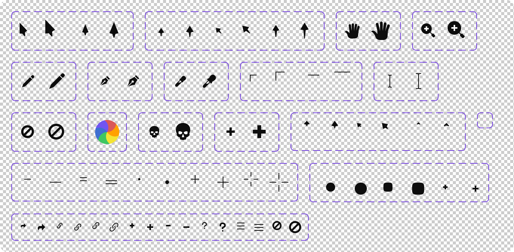

# Phinger cursors

Say hello to your new cursor theme. Phinger cursors is most likely the most over engineered cursor theme out there.



## How to install

If you are on Arch linux, you can install the AUR package [phinger-cursors](https://aur.archlinux.org/packages/phinger-cursors).

Other distros currently don't yet have phinger-cursors in their repositories. So please install manually, as described below.

### Manually

For a manual installation, download and extract the [latest release](https://github.com/phisch/phinger-cursors/releases/latest/download/phinger-cursors-variants.tar.bz2) into the `~/.icons` directory.

```sh
wget -cO- https://github.com/phisch/phinger-cursors/releases/latest/download/phinger-cursors-variants.tar.bz2 | tar xfj - -C ~/.icons
```

This installs the cursor theme for your current user. To install for all users, extract into `/usr/share/icons` instead.

## How to enable

You might have a settings application installed that can do this for you like [Gnome Tweaks](https://gitlab.gnome.org/GNOME/gnome-tweaks) or [lxappearance](https://wiki.lxde.org/en/LXAppearance). If you don't, enable the cursor theme as described below.

### Manually

Enable your prefered variant (`phinger-cursors` or `phinger-cursors-light`) inside `~/.icons/default/index.theme`:

```ini
[Icon Theme]
Name=Default
Comment=Default Cursor Theme
Inherits=phinger-cursors-light
```

And finally, enable it for GTK applications in your `~/.config/gtk-3.0/settings.ini`:

```ini
[Settings]
gtk-cursor-theme-name=phinger-cursors-light
```

## How to change cursor size

The available cursor sizes are `24`, `32`, `48`, `64`, `96` and `128`. How to change it depends on your current environment.

### GNOME, MATE, XFCE

Run the following command and replace `CURSOR_SIZE` with your prefered one:

- on GNOME: `gsettings set org.gnome.desktop.interface cursor-size CURSOR_SIZE`
- on MATE: `gsettings set org.mate.peripherals-mouse CURSOR_SIZE`
- on XFCE: `xfconf-query --channel xsettings --property /Gtk/CursorThemeSize --set CURSOR_SIZE`

### Xresources

Add this line to your `~/.Xresources` and replace `CURSOR_SIZE` with your prefered one:

```sh
Xcursor.size: CURSOR_SIZE
```

## How it's made

Phinger-cursors are designed in a [Figma](https://www.figma.com) document. Check out the [multi-page Figma document](https://www.figma.com/file/zU99op23bu3Cg438YkhZy8/phinger-cursors) used by this repository.

You can find an up to date copy of that document in this repositories root directory at [phinger-cursors.fig](phinger-cursors.fig).

### Parts

Every cursor sprite is assembled from core parts. Changing one of those parts, will change every cursor sprite that uses it.



Each part is designed on a base grid of 24 and 32:


which means will be pixel perfect for any reasonable size:

| 24 | 32 | 48 | 64 | 96 | 128 |
|:-:|:-:|:-:|:-:|:-:|:-:|
|  |  |  |  |  |  |

If possible, parts are designed very modular, which lets you create multiple different icons from one part. A good example is the hand part that comes with multiple variations for each single phinger:


### Sprites

The parts are assembled, and styled into sprites. Those sprites are named and contain metadata necessary to generate a cursor theme from them. Each sprite contains a name, information about the cursor hotspot, animation and which kind of variant it is.

### Build process

This repository contains a GitHub workflow, that generates a fully functional X11 cursor theme and variants from the linked figma file. The workflow is defined in [.github/workflows/main.yml](.github/workflows/main.yml).

It uses the custom made GitHub Action [phisch/figma-cursor-theme-action](https://github.com/phisch/figma-cursor-theme-action) to do that.

This action exports assets from the Figma file and commits them to [assets](assets), then renders the sprites into pngs and packs them into proper (and if necessary animated) x11 cursor files. It also generates symlinks and variants, bundles them, and creates a release.

Please refer to the actions [README.md](https://github.com/phisch/figma-cursor-theme-action#readme) for a detailed documentation.

## License & Credits
All assets, including the Figma document are licensed under the [CC-BY-SA-4.0 License](LICENSE).

The X11 and Wayland cursors are designed from scratch, and not copied. The original logos belong to X11 and Wayland respectively though.

Although designed from scratch, phinger cursors drew inspiration from [capitaine-cursors](https://github.com/keeferrourke/capitaine-cursors), which is based on the KDE Breeze cursors. So this is a special thanks to them, and all other amazing cursor themes out there!

## Contribute

If you notice any issues like missing cursors or symlinks, something doesn't look quite right to you, or you have suggestions for better designs or new cursors, please open an issue and let me know about it.

I can't let people contribute to the Figma document directly, but I will listen to constructive feedback through GitHub issues.

### Desktop Makers Discord

<a href="https://discord.gg/DdVdR7TdRk" title="Desktop Makers"></a>

I am actively working on phinger-cursors and other cool projects on the [Desktop Makers Discord server](https://discord.gg/DdVdR7TdRk). It aims to be a community for communities of Linux desktop related projects and close the gap between the awesome people behind them. If you are looking to collaborate with or want to get involved in great projects, this might be the right place for you.
